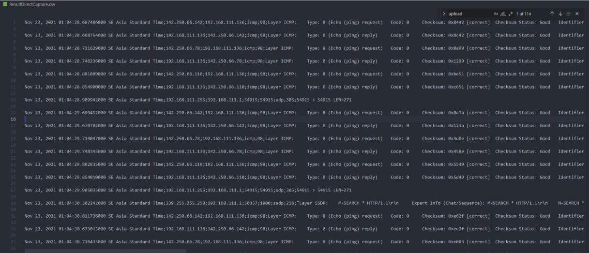
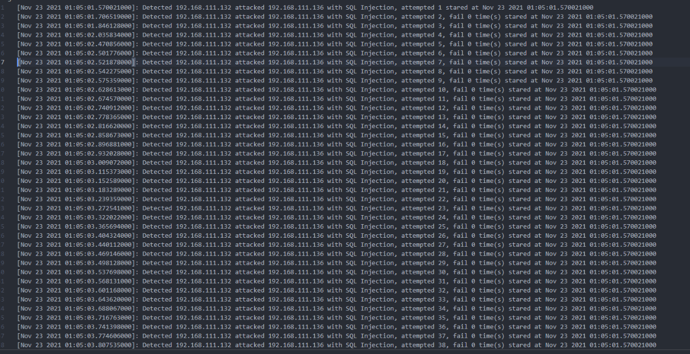

# Detect SQLInjection With Pyshark

> Project is used for detect SQL Injection from CVE-2018-17552

## Table of Contents

- [General](#general)
- [Technologies used](#Technologies-used)
- [Features](#features)
- [Screenshots](#Screenshots)
- [Setup](#setup)
- [Usage](#usage)
- [Acknowledgements](#Acknowledgements)

## General

- Project for detecting and alert to the user when navigate is attacked with sql injection based on CVE-2018-17552.

## Technologies used

- Pyshark
- Python 3 above

## Features

- Capture package.
- Analyze package.

## Screenshots

- Capture data and save to file .xls
  
- Use data from .xls file analyze to detect attack 

## Setup

### For windows

- Install wireshark to have Tshark included Pyshark

### For Ubuntu

- `Pip install Pyshark`
- `Apt install tshark`

## Usage

- Run DirectCapture<!--text-->.py first in order to create captured data and run AnalyzeCapture<!--text-->.py after that

### DirectCapture<!--text-->.py

- Use terminal to run `python3 DirectCatpure.py [your-network-interface]`

### AnalyzeCapture<!--text-->.py

- Use terminal to run `python3 AnayzeCapture.py`

## Acknowledgements

- Detail about CVE: https://nvd.nist.gov/vuln/detail/CVE-2021-37475
- Pyshark documents: https://github.com/KimiNewt/pyshark
